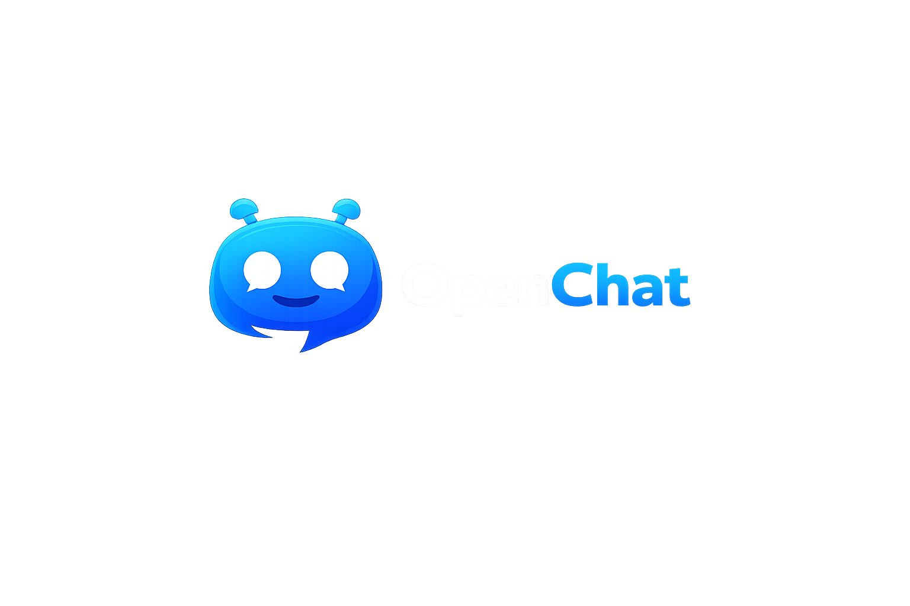
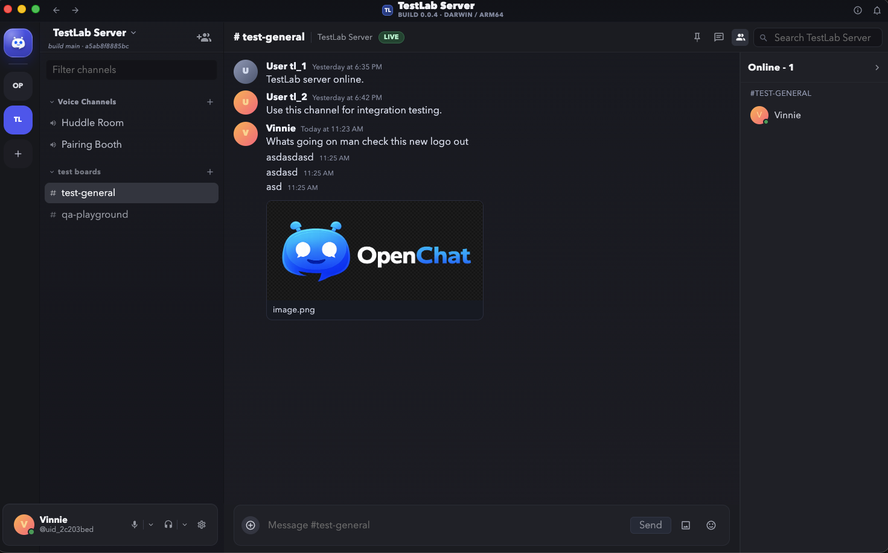

OpenChat Client is an open-source Electron desktop app with a Discord-like UX where each joined server maps to an independent backend endpoint.



## Release Stage
- Project maturity: `Pre-Alpha`
- Stability expectation: interfaces and behavior may change without backward compatibility until Beta.

## What This Repository Is
- A desktop client built with `Electron`, `Vue 3`, `Pinia`, and `PrimeVue` (unstyled).
- A multi-server client with isolated server-scoped state and trust boundaries.
- A frontend-first open-source project with ADRs, feature specs, and milestone tracking.

## What This Repository Is Not
- Not a backend service repository.
- Not a deployment/infrastructure repo for backend runtime.
- Not a place for server-side business logic implementation.

## Current Project Status
- Milestone `M0` (Project Foundation): `done`
- Milestone `M1` (Multi-Server Shell): `done`
- Milestone `M2` (Core Messaging UX): `done`
- Milestone `M3` (Hardening and Open-Source Readiness): `in_progress`

Details: `docs/release/milestones.md`

## Feature Snapshot
| Area | Status |
| --- | --- |
| Server discovery/join + trust probe | Implemented |
| Multi-server switching/isolation | Implemented |
| Text channels + message timeline/composer | Implemented |
| Realtime messaging + typing + presence | Implemented |
| Voice channel join + audio relay controls | Implemented baseline (hardening in progress) |
| Video/screenshare surfaces | Planned |
| Settings/accessibility deep pass | In progress |
| Moderation/governance UX | Planned |

## Quickstart (Development)
Prerequisites:
- Node.js `>= 23.9.0`
- Corepack enabled (`corepack enable`)

Install and run:
```bash
corepack prepare yarn@4 --activate
corepack yarn install --immutable
corepack yarn dev
```

Quality checks:
```bash
corepack yarn typecheck
corepack yarn build
```

## Backend Connection for Local Testing
- Runtime default backend URL: `https://openchat.marone.us`
- Override with env var: `VITE_OPENCHAT_BACKEND_URL`
- Local backend example: `VITE_OPENCHAT_BACKEND_URL=http://localhost:8080`
- Server directory endpoint expected by client: `/v1/servers`

## Production Builds and Installers
For end users, use release artifacts from GitHub Releases.

Maintainer local packaging:
```bash
corepack yarn pack   # unpacked app output
corepack yarn dist   # platform installer artifacts in release/
```

Release pipeline:
- Tag format: `vX.X.X`
- Workflow: `.github/workflows/release-desktop.yml`
- Targets: macOS, Windows, Linux installers + release asset publish

Signing/notarization secrets (optional but recommended):
- macOS (Developer ID + App Store Connect API key): `MACOS_CERT_P12_BASE64`, `MACOS_CERT_PASSWORD`, `APPLE_API_KEY_P8`, `APPLE_API_KEY_ID`, `APPLE_API_ISSUER`
- Windows: `WINDOWS_CERT_PFX_BASE64`, `WINDOWS_CERT_PASSWORD`

Unsigned builds still generate artifacts, but OS trust warnings are expected.

macOS entitlement note:
- `build/entitlements.mac.plist` includes media keys (`com.apple.security.device.audio-input`, `com.apple.security.device.camera`) and network keys (`com.apple.security.network.client`, `com.apple.security.network.server`).
- `electron-builder.yml` sets `NSMicrophoneUsageDescription`, `NSCameraUsageDescription`, and `NSScreenCaptureDescription` so notarized builds can display required runtime privacy prompts.
- For the current non-App-Store Developer ID flow (App Sandbox disabled), network access is already allowed; network entitlements are relevant if App Sandbox is enabled later.

## Documentation Map
- Planning and constraints: `AGENTS.md`
- Contributing: `CONTRIBUTING.md`
- Security policy: `SECURITY.md`
- Support: `SUPPORT.md`
- Architecture index: `docs/architecture/README.md`
- ADR index: `docs/architecture/adrs/README.md`
- Backend contract: `docs/architecture/backend-contract.md`
- Design system notes: `docs/architecture/design-system.md`
- Feature specs: `docs/features/README.md`
- Release milestones: `docs/release/milestones.md`

## Contributing
Contributions are welcome.

Start here:
1. Read `CONTRIBUTING.md`.
2. Check open milestones and feature specs.
3. Open an issue/proposal for major behavior changes.

## Security
For vulnerability reporting and policy, see `SECURITY.md`.

## License
This project is licensed under GNU General Public License v2.0 only (`GPL-2.0-only`).
See `LICENSE.md` for the full license text.
