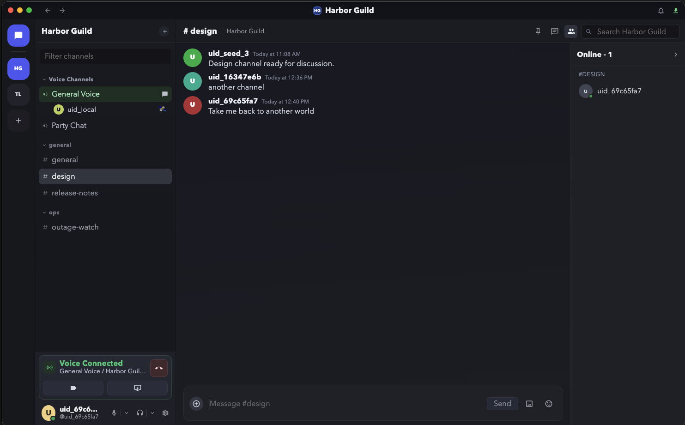

# OpenChat Client

OpenChat Client is an open-source Electron desktop app that provides a Discord-like experience while connecting each joined server to its own independent backend.

## Status
- Early implementation phase (Milestone 0 scaffolding).
- Desktop installer pipeline is configured (tag-based GitHub Actions builds).
- Repository now includes initial Electron + Vue runtime plus planning docs.

## Scope
- Client-side desktop application only.
- Frontend stack direction: Electron + Vue 3 + PrimeVue (unstyled) + Pinia.
- Multi-server UX where each server entry maps to a distinct backend endpoint.
- User data ownership model: personal identity/profile remains local; servers know only `user_uid` plus required protocol proofs.
- Package manager/runtime mode: Yarn v4 with `node-modules` linker.

This repo does not include backend service code.

## Project Principles
- Keep user experience familiar, fast, and keyboard-friendly.
- Isolate server data and trust boundaries per server.
- Keep user identity/profile ownership local to the client by default.
- Ship with strong security defaults for Electron and credentials.
- Require documentation for user-facing features before implementation.

## Documentation Map
- Planning document: `AGENTS.md`
- Contributing guide: `CONTRIBUTING.md`
- Security policy: `SECURITY.md`
- Support policy: `SUPPORT.md`
- Architecture docs: `docs/architecture/README.md`
- ADR index: `docs/architecture/adrs/README.md`
- Backend contract: `docs/architecture/backend-contract.md`
- Design system architecture: `docs/architecture/design-system.md`
- Feature specs: `docs/features/README.md`
- Milestones: `docs/release/milestones.md`

## Getting Started (Current Phase)
1. Read `AGENTS.md` for scope and milestones.
2. Read `docs/architecture/adrs/README.md` for accepted technical decisions.
3. Install dependencies: `yarn install`
4. Start desktop app in dev mode: `yarn dev`
5. Type-check renderer/main/preload code: `yarn typecheck`
6. Use `docs/features/FEATURE_TEMPLATE.md` for new feature proposals.

## Desktop Installers
Users should install release binaries, not build from source.

Tag-based release process:
1. Push a tag in the format `client-vX.X.X`.
2. GitHub Actions workflow `.github/workflows/release-desktop.yml` builds installers for macOS, Windows, and Linux.
3. The workflow publishes assets to a GitHub Release for that tag.

macOS signing/notarization (required for end-user install UX):
- `APPLE_CERTIFICATE_P12_BASE64` (Developer ID Application cert exported as base64 `.p12`)
- `APPLE_CERTIFICATE_PASSWORD` (password for the `.p12`)
- `APPLE_ID` (Apple ID email)
- `APPLE_APP_SPECIFIC_PASSWORD` (app-specific password for notarization)
- `APPLE_TEAM_ID` (Apple Developer team id)

If these are missing, CI still builds mac artifacts but they are unsigned and may be blocked by Gatekeeper as damaged/untrusted.

Windows code signing (recommended for SmartScreen + verified publisher UX):
- `WINDOWS_CERT_PFX_BASE64` (code-signing `.pfx` exported as base64)
- `WINDOWS_CERT_PASSWORD` (password for the `.pfx`)

If these are missing, CI still builds Windows artifacts but they are unsigned and Windows may show publisher/security warnings.

Local packaging (maintainers):
- `yarn pack`: builds unpacked app output.
- `yarn dist`: builds platform installer artifacts in `release/`.

## Open Source Contribution
Contributions are welcome. Start with `CONTRIBUTING.md`, then open an issue or proposal before major changes.

## License
License to be added before first public release candidate.